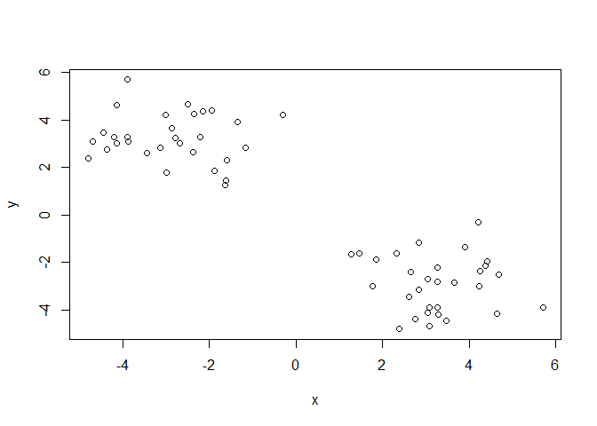
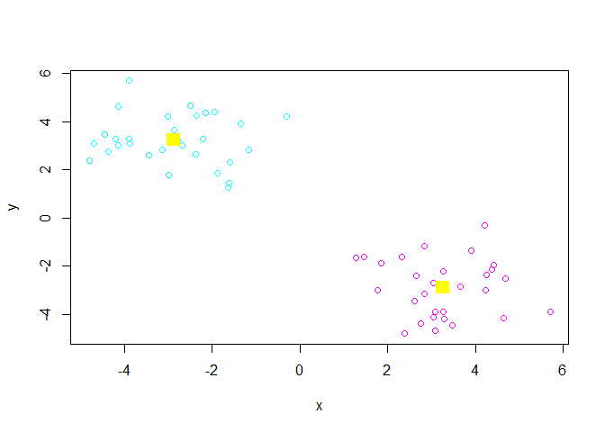
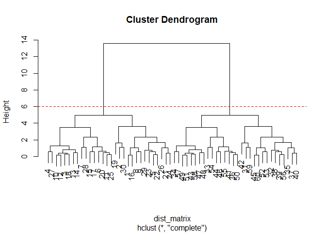
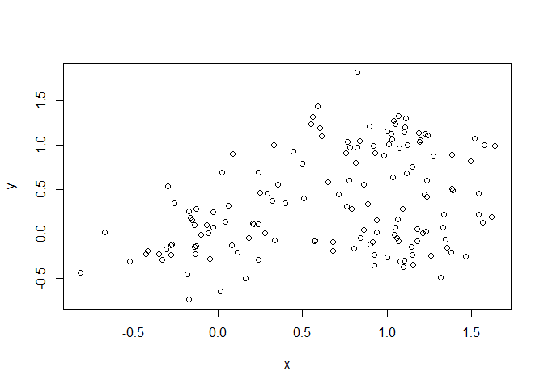
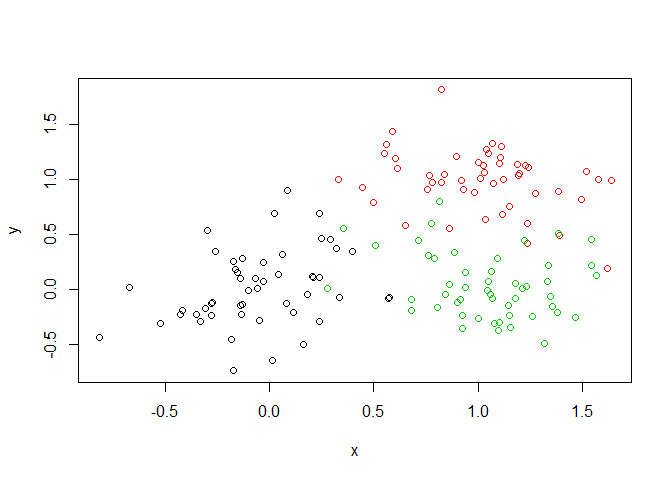
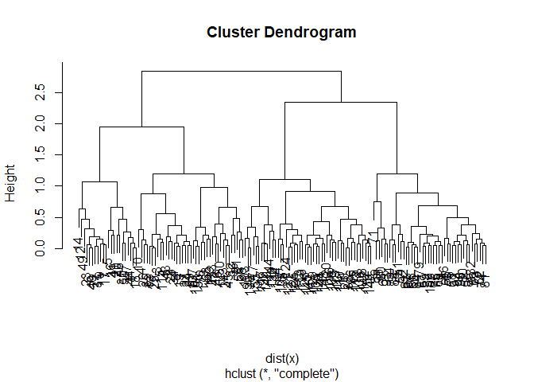
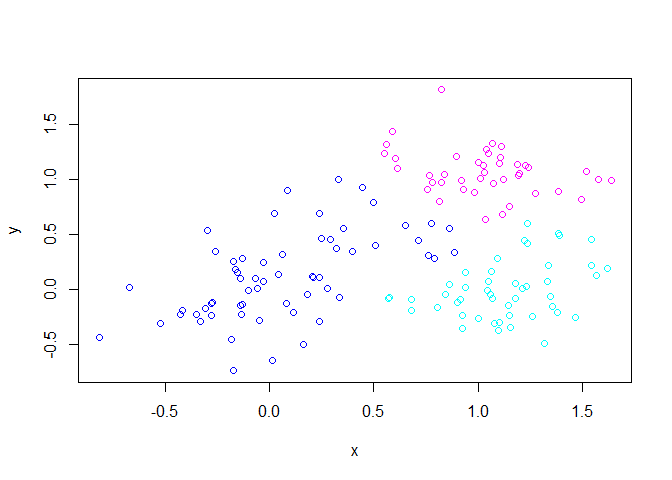
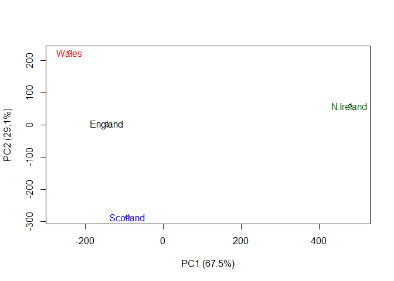

Class 9 02052020
================
Jenny
2/5/2020

## K-means clustering

Let’s try the `kmeans()` function

``` r
tmp <- c(rnorm(30,-3), rnorm(30,3))
x <- cbind(x=tmp, y=rev(tmp))

plot(x)
```

<!-- -->

Use the `kmeans()` function setting k to 2 and nstart to 20

``` r
km <- kmeans(x, centers = 2, nstart = 20)
```

Inspect the result

``` r
km
```

    ## K-means clustering with 2 clusters of sizes 30, 30
    ## 
    ## Cluster means:
    ##           x         y
    ## 1 -2.878956  3.255891
    ## 2  3.255891 -2.878956
    ## 
    ## Clustering vector:
    ##  [1] 1 1 1 1 1 1 1 1 1 1 1 1 1 1 1 1 1 1 1 1 1 1 1 1 1 1 1 1 1 1 2 2 2 2 2 2 2 2
    ## [39] 2 2 2 2 2 2 2 2 2 2 2 2 2 2 2 2 2 2 2 2 2 2
    ## 
    ## Within cluster sum of squares by cluster:
    ## [1] 70.63455 70.63455
    ##  (between_SS / total_SS =  88.9 %)
    ## 
    ## Available components:
    ## 
    ## [1] "cluster"      "centers"      "totss"        "withinss"     "tot.withinss"
    ## [6] "betweenss"    "size"         "iter"         "ifault"

What is in the output object

``` r
attributes(km)
```

    ## $names
    ## [1] "cluster"      "centers"      "totss"        "withinss"     "tot.withinss"
    ## [6] "betweenss"    "size"         "iter"         "ifault"      
    ## 
    ## $class
    ## [1] "kmeans"

Q. How many points are in each cluster?

``` r
km$size
```

    ## [1] 30 30

Q. What component of your result object details -cluster size -cluster
assignment/membership -cluster center

``` r
km$cluster
```

    ##  [1] 1 1 1 1 1 1 1 1 1 1 1 1 1 1 1 1 1 1 1 1 1 1 1 1 1 1 1 1 1 1 2 2 2 2 2 2 2 2
    ## [39] 2 2 2 2 2 2 2 2 2 2 2 2 2 2 2 2 2 2 2 2 2 2

``` r
table(km$cluster)
```

    ## 
    ##  1  2 
    ## 30 30

Plot it out

``` r
plot(x, col=km$cluster+4)
points(km$centers, col=7, pch=15, cex=2)
```

<!-- -->

\#\#Hierarchal clustering Do not need to know how many clusters to
expect from the final analysis \# First we need to calculate point
(dis)similarity \# as the Euclidean distance between observations

``` r
dist_matrix <- dist(x)
```

# The hclust() function returns a hierarchical

# clustering model

``` r
hc <- hclust(d = dist_matrix)
plot(hc)
abline(h=6, col="red", lty=2)
```

<!-- -->

``` r
cutree(hc, h=6)
```

    ##  [1] 1 1 1 1 1 1 1 1 1 1 1 1 1 1 1 1 1 1 1 1 1 1 1 1 1 1 1 1 1 1 2 2 2 2 2 2 2 2
    ## [39] 2 2 2 2 2 2 2 2 2 2 2 2 2 2 2 2 2 2 2 2 2 2

``` r
table(cutree(hc, h=3.5))
```

    ## 
    ##  1  2  3  4  5  6  7  8 
    ## 11  3  8  8  3 11  8  8

# Using different hierarchical clustering methods

``` r
# Step 1. Generate some example data for clustering
x <- rbind(
 matrix(rnorm(100, mean=0, sd=0.3), ncol = 2), # c1
 matrix(rnorm(100, mean=1, sd=0.3), ncol = 2), # c2
 matrix(c(rnorm(50, mean=1, sd=0.3), # c3
 rnorm(50, mean=0, sd=0.3)), ncol = 2))
colnames(x) <- c("x", "y")

# Step 2. Plot the data without clustering
plot(x)
```

<!-- -->

``` r
# Step 3. Generate colors for known clusters
# (just so we can compare to hclust results)
col <- as.factor( rep(c("c1","c2","c3"), each=50) )
plot(x, col=col)
```

<!-- -->

Q. Use the dist(), hclust(), plot() and cutree() functions to return 2
and 3 clusters

``` r
hc <- hclust(dist(x))

plot(hc)
```

<!-- -->

\#see three major groups, so use cutree to make three clusters

``` r
grps3 <- cutree(hc, k=3)
table(grps3)
```

    ## grps3
    ##  1  2  3 
    ## 61 47 42

Q. How does this compare to your known ‘col’ groups?

``` r
plot(x, col=grps3+3)
```

<!-- -->

## PCA of Eating Habits in the UK

``` r
x <- read.csv("UK_foods.csv", row.names = 1)
x
```

    ##                     England Wales Scotland N.Ireland
    ## Cheese                  105   103      103        66
    ## Carcass_meat            245   227      242       267
    ## Other_meat              685   803      750       586
    ## Fish                    147   160      122        93
    ## Fats_and_oils           193   235      184       209
    ## Sugars                  156   175      147       139
    ## Fresh_potatoes          720   874      566      1033
    ## Fresh_Veg               253   265      171       143
    ## Other_Veg               488   570      418       355
    ## Processed_potatoes      198   203      220       187
    ## Processed_Veg           360   365      337       334
    ## Fresh_fruit            1102  1137      957       674
    ## Cereals                1472  1582     1462      1494
    ## Beverages                57    73       53        47
    ## Soft_drinks            1374  1256     1572      1506
    ## Alcoholic_drinks        375   475      458       135
    ## Confectionery            54    64       62        41

``` r
barplot(as.matrix(x), beside=T, col=rainbow(nrow(x)))
```

<!-- -->

``` r
pairs(x, col=rainbow(10), pch=16)
```

<!-- -->

``` r
# Use the prcomp() PCA function 
pca <- prcomp( t(x) )
summary(pca)
```

    ## Importance of components:
    ##                             PC1      PC2      PC3       PC4
    ## Standard deviation     324.1502 212.7478 73.87622 4.189e-14
    ## Proportion of Variance   0.6744   0.2905  0.03503 0.000e+00
    ## Cumulative Proportion    0.6744   0.9650  1.00000 1.000e+00

Looking at the data for proportion of variance, you can see that that
PC1 accounts for 67% of the variance and PC2 accounts for 29%, meaning
that if you compare PC1 and PC2 you can account for 96.5% of the
variance between the data sets

``` r
# Plot PC1 vs PC2
plot(pca$x[,1], pca$x[,2], xlab="PC1 (67.5%)", ylab="PC2 (29.1%)", xlim=c(-270,500))
text(pca$x[,1], pca$x[,2], colnames(x), col=c("black", "red", "blue", "darkgreen"))
```

<!-- -->
