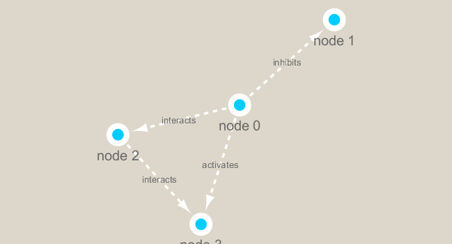

```{r setup, include=FALSE}
knitr::opts_chunk$set(echo = TRUE)
```

```{r eval=FALSE}
install.packages("igraph")
```

```{r}
library(igraph)
library(RCy3)
```

Can we talk to cytoscape?

```{r}
cytoscapePing()
```

```{r}
g <- makeSimpleIgraph()
createNetworkFromIgraph(g, "myGraph")
```

```{r}
setVisualStyle("Marquee")
```

Lets save an image from cytoscape

```{r}
fig <- exportImage(filename="demo_marquee", type="png", height=350)


```


```{r}
plot(g)
```


```{r}
## scripts for processing located in "inst/data-raw/"
prok_vir_cor <- read.delim("virus_prok_cor_abundant.tsv", stringsAsFactors = F)

## Have a peak at the first 6 rows
head(prok_vir_cor)
```

```{r}
g <- graph.data.frame(prok_vir_cor, directed = FALSE)

class(g)
g
```

```{r}
plot(g)
```

```{r}
plot(g, vertex.label=NA)
```

```{r}
plot(g, vertex.size=3, vertex.label=NA)
```

```{r}
cb <- cluster_edge_betweenness(g)

plot(cb, y=g, vertex.label=NA,  vertex.size=3)
```

  Centrality analysis
Centrality gives an estimation on how important a node or edge is for the connectivity (or the information flow) of a network. It is a particularly useful parameter in signaling networks and it is often used when trying to find drug targets for example.

Centrality analysis often aims to answer the following question: Which nodes are the most important and why?

One centrality method that you can often find in publications is the Google PageRank score. For the explanation of the PageRank algorithm, see the following webpage: http://infolab.stanford.edu/~backrub/google.html

```{r}
pr <- page_rank(g)
head(pr$vector)

# Make a size vector btwn 2 and 20 for node plotting size
library(BBmisc)
v.size <- BBmisc::normalize(pr$vector, range=c(2,20), method="range")
plot(g, vertex.size=v.size, vertex.label=NA)
```
 
