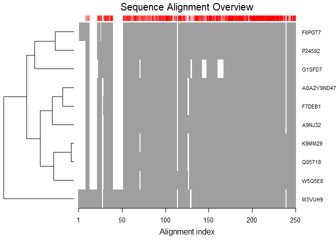
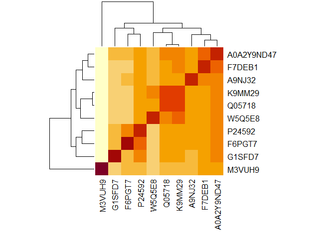

Find a Gene Project
================
Jenny
3/12/2020

## R Markdown

This is an R Markdown document. Markdown is a simple formatting syntax
for authoring HTML, PDF, and MS Word documents. For more details on
using R Markdown see <http://rmarkdown.rstudio.com>.

When you click the **Knit** button a document will be generated that
includes both content as well as the output of any embedded R code
chunks within the document. You can embed an R code chunk like this:

``` r
summary(cars)
```

    ##      speed           dist       
    ##  Min.   : 4.0   Min.   :  2.00  
    ##  1st Qu.:12.0   1st Qu.: 26.00  
    ##  Median :15.0   Median : 36.00  
    ##  Mean   :15.4   Mean   : 42.98  
    ##  3rd Qu.:19.0   3rd Qu.: 56.00  
    ##  Max.   :25.0   Max.   :120.00

## Including Plots

You can also embed plots, for example:

<!-- -->

Note that the `echo = FALSE` parameter was added to the code chunk to
prevent printing of the R code that generated the plot.

## Generate a heatmap of a multiple alignment of multiple species with proteins similar in identity to human IGFBP-6

\#Initiate the Bio3D package

``` r
library(bio3d)
```

    ## Warning: package 'bio3d' was built under R version 3.6.3

\#Read the fasta file for the alignment

``` r
fasta <- read.fasta("A20200312A94466D2655679D1FD8953E075198DA801240AL.fasta.txt")
fasta
```

    ##              1        .         .         .         .         .         60 
    ## P24592       ---------MTPHR----------LLPPLLLLLALLLAASPGGA------------LARC
    ## F6PGT7       -MYLEKSMDDWEGR----------LLPP-LLLLALLLAANPGGT------------LARC
    ## W5Q5E8       ---------MTPHR----------LLPPLL--LTLLLAARPGGA------------LARC
    ## A9NJ32       ---------MIPHR----------LLPPLL--LTLLLAARPGGA------------LAQC
    ## Q05718       ---------MTPHR----------LLPPLL--LTLLLAARPGGA------------LARC
    ## F7DEB1       ---------MTPHR----------LLPSLL-LLTLLLAARAGGA------------LARC
    ## M3VUH9       LPTLSPSLPLLPPTVLSPRLAPGPCFPTLT-SQALLFLASPLGYFLPSAVGYPKTPLPII
    ## K9MM29       ---------MTPHR----------LLPPLL--LTLLLAARPGGA------------LARC
    ## G1SFD7       ---------MTAPG-----------LLPLLLLLTLQLAARPGGA------------LARC
    ## A0A2Y9ND47   ---------MTPHR----------LLPPLL--LTLLLAARPGGA------------LARC
    ##                                                *   *   *             *    
    ##              1        .         .         .         .         .         60 
    ## 
    ##             61        .         .         .         .         .         120 
    ## P24592       PGCGQGVQAGCPGGCVEEEDGGSPAEGCAEAEGCLRREGQECGVYTPNCAPGLQCHPPKD
    ## F6PGT7       PGCGQGVQAGCPGGCVEEEDGGPPAEICSDAEGCLRREGQKCGVYTPNCAPGLRCHPPEN
    ## W5Q5E8       PGCGQGVSAGCPGGCAE-EDGGPAAEGCAEAGGCLRREGQQCGVYTPNCAPGLQCQPPEL
    ## A9NJ32       PGCGQGVQTGCPGGCAEEEDGGPPTEGCAEAGGCLRREGQQCGVYTPNCAPGLQCQPAGD
    ## Q05718       PGCGQGVSAGCPGGCAEEEDGGPAAEGCAEAGGCLRREGQQCGVYTPNCAPGLQCQPPEK
    ## F7DEB1       PGCGQGVQAGCPGACVEEEDGGPPAEGCAEAGGCFRKEGQQCGVYTPNCAPGLQCQPPEE
    ## M3VUH9       PAFSLSLGTHLPGDSHTPSLPHPSQTTVPSPPESPPAASAPTGHRHPRWIPGLQCQPPEE
    ## K9MM29       PGCGQGVSAGCPGGCAE-EDGGPAAEGCAEAGGCLRREGQQCGVYTPNCAPGLQCQPPEK
    ## G1SFD7       RGCGQGAQAACPEGCVE-EDGAPPAERCTEARGCLRKEGQHCGVYTPYCAPGLQCLPPKD
    ## A0A2Y9ND47   PGCGQGVQAGCPGGCVEEEDGGPPAEGCAEAGGCLRREGQQCGVYTPNCAPGLQCQPPEK
    ##               ^         *                              *   *   *** * *    
    ##             61        .         .         .         .         .         120 
    ## 
    ##            121        .         .         .         .         .         180 
    ## P24592       DEAP-LRALLLGRGRCLPARAPAVAEENPKESKPQAGTARPQDVNRRDQQRNPGTSTTPS
    ## F6PGT7       DEAP-LRALLLGRGRCLPARAPAVAEKNPKESKSQADTARPQDVNRRDRQRNPGTSTTPS
    ## W5Q5E8       EKETRVRGLALALSPAPR-GRVRAVGENPKESKPQAGTARSQDVNRRDQQRNSGTSTTPV
    ## A9NJ32       DEAP-LRALLLGRGRCLPARAPAAVGENPKESKPQAGTTRSQDVNRRDPQKSPGTSTTPS
    ## Q05718       EDLP-LRALLQGRGRCG--RARTPSGENPKESKPQAGTARSQDVNRRDQQRNSGTSTTPS
    ## F7DEB1       DEAP-LRALLLGRGRCR--RARAPSGENPKEGKPQAGTTRTQDVNRRDQQRNPGTSTTPG
    ## M3VUH9       DEAP-LRALLLGRGRCRRAR--APSGENPKEGKSQAGTTRPQDVNRRDQQRNPGTSTTPA
    ## K9MM29       EDLP-LRALLQGRGRCV--RARTPSGENPKESKPQAGTARSQDVNRRDQQRNSGTSTTPV
    ## G1SFD7       DEAP-LRALLLGRGSCREARA--PSEEHPKESKPK------QDMNRRDQQRHPGT-----
    ## A0A2Y9ND47   DEAP-LRALLLGRGRCG--RARAPSGENPKESKPQAGTTRQQDMNRRDQQRNPGTSTTPA
    ##              ^    ^*^*  ^                *** *        **^**** *^  **      
    ##            121        .         .         .         .         .         180 
    ## 
    ##            181        .         .         .         .         .         240 
    ## P24592       QPNSAGVQDTEMGPCRRHLDSVLQQLQTEVYRGAQTLYVPNCDHRGFYRKRQCRSSQGQR
    ## F6PGT7       QPSSAGVQDTEMGPCRRHLDSVLQQLHTAVYRGTQTLYVPNCDHRGFYRKRQCRSSQGQR
    ## W5Q5E8       RPNSGGVQDTEMGPCRKHLDSVLQQLQTEVFRGSHTLYVPNCDHRGFYRKRQCRSSQGQR
    ## A9NJ32       RPNPGGVQDTEMGPCRRHLDSVLQQLQTEVFRGAHTLYVPNCDHRGFYRKRQCGSSHGQR
    ## Q05718       RSNSGGVQDTEMGPCRKHLDSVLQQLQTEVFRGAHTLYVPNCDHRGFYRKRQCRSSQGQR
    ## F7DEB1       RPNPGGVQDTEMGPCRRHLDSVLQQLQTEVYRGSHTLYVPNCDHRGFYRKRQCRSSQGQR
    ## M3VUH9       RPSPGGAQDTEMGPCRRHLDSVLQQLQTEVYRGAQTLYVPNCDHRGFYRKRQCRSSQGQR
    ## K9MM29       RPNSGGVQDTEMGPCRKHLDSVLQQLQTEVFRGAHTLYVPNCDHRGFYRKRQCRSSQGQR
    ## G1SFD7       --NSGGAQDTEMGPCRRHLDTVLQQLQTEIFRGTQPLYVPNCDHRGFYRRRQCRSSQGQR
    ## A0A2Y9ND47   RPNPGGVQDTEMGPCRRHLDSVLQQLQTEIYRGVHTLYVPNCDHRGFYRKRQCRSSQGQR
    ##                  ^* *********^***^***** * ^^**   *************^*** ** *** 
    ##            181        .         .         .         .         .         240 
    ## 
    ##            241        .         .         .  273 
    ## P24592       RGPCWCVDRMGKSLPGSPDG-NGSSSCPTGSSG
    ## F6PGT7       RGPCWCVDRMGQPLPGSPDG-NGSSSCPIGSRR
    ## W5Q5E8       RGPCWCVDRMGQPLPGSSEGGGGSPLRPPGGSG
    ## A9NJ32       RGPCWCVDRMGQPLAGSPDG-DGNAPCPSGSSG
    ## Q05718       RGPCWCVERMGQPLPGSSEGGDGSSLCPTGSSG
    ## F7DEB1       RGPCWCVDRMGQPLPGSPDG-DGGSPCPAGSSG
    ## M3VUH9       RGPCWCVDRMGQPLPGSPEG-EGGSSCPTGSSG
    ## K9MM29       RGPCWCVDRMGQPLPGSSEGGDGSSLCPTGSSG
    ## G1SFD7       RGPCWCVDRMGQPLPGTPDG-NGSISCPSGSSG
    ## A0A2Y9ND47   RGPCWCVDRMGQPLPGSPDG-DGSSLCPTGSSG
    ##              *******^***  * *^ ^*  *    * *    
    ##            241        .         .         .  273 
    ## 
    ## Call:
    ##   read.fasta(file = "A20200312A94466D2655679D1FD8953E075198DA801240AL.fasta.txt")
    ## 
    ## Class:
    ##   fasta
    ## 
    ## Alignment dimensions:
    ##   10 sequence rows; 273 position columns (217 non-gap, 56 gap) 
    ## 
    ## + attr: id, ali, call

\#Plot the alignment

``` r
plot.fasta(fasta, mar4 = 5, )
```

<!-- -->

\#Generate a sequence identity matrix and plot via heatmap

``` r
identity <- seqidentity(fasta)
heatmap(identity, margins = c(8,8))
```

<!-- -->
